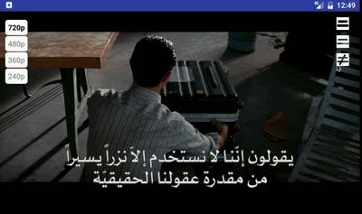

Features
==
<li> OkHttpDataSource
<li> Subtitles (.srt files, e.g., Arabic subtitles)


Setup
==
Adding CinemanaPlayer Activity to your Manifest.xml
```
<activity android:name="org.earthlink.cinemana.player.CinemanaVideoPlayer"
    android:configChanges="orientation|screenSize|keyboardHidden"
    />
```


API
==
```
Intent i = new Intent(this, CinemanaVideoPlayer.class);
i.putExtra(CinemanaVideoPlayer.KEY_VIDEO_FILE, videoFile);
i.putExtra(CinemanaVideoPlayer.KEY_START_POSITION, 0);

startActivity(i);

```


where:
<li> **videoFile**: A data structure that has a `HashMap` containing a resolution and its url link.

The *VideoFile* data structure is shown below:

```
    public static int QUALITY_720P = 3;
    public static int QUALITY_480P = 2;
    public static int QUALITY_360P = 1;
    public static int QUALITY_240P = 0;

    public static final int DASH = 0;
    public static final int SS = 1;
    public static final int HLS = 2;
    public static final int OTHER = 3;  // MP4 or WebM


    public int videoType = OTHER;

    public String title;
    public HashMap<Integer, String> resolutions = new HashMap<>();  // <quality, url>; e.g, <QUALITY_720P,     "http://example.com/video720p.mp4"
    public int selectedResolutioin;

    public String arTranslationFilePath;  // is the url link of the subtitle as an `srt` format.

```


Subtitles
==

```
Format textFormat = Format.createTextSampleFormat(null, MimeTypes.APPLICATION_SUBRIP,
        null, Format.NO_VALUE, Format.NO_VALUE, "ar", null);


MediaSource subtitleSource =
        new SingleSampleMediaSource(subtitleUri,
                mediaDataSourceFactory, textFormat, C.TIME_UNSET);

ExtractorMediaSource extractorMediaSource =
        new ExtractorMediaSource(uri, mediaDataSourceFactory, new DefaultExtractorsFactory(),
                mainHandler, eventLogger);
```

The subtitles style can be configured from the library in the file [`CinemanaVideoPlayer.java`](https://github.com/bluemix/CinemanaPlayer/blob/master/cinemanna-player-library/src/main/java/org/earthlink/cinemana/player/CinemanaVideoPlayer.java):


```
    private void configureSubtitleView() {
        int defaultSubtitleColor = Color.argb(255, 218, 218, 218);
        int outlineColor = Color.argb(255, 43, 43, 43);
        Typeface subtitleTypeface = Typeface.createFromAsset(surfaceView.getContext().getAssets(), "fonts/Abdo-Line.otf");
        CaptionStyleCompat style =
                new CaptionStyleCompat(defaultSubtitleColor,
                        Color.TRANSPARENT, Color.TRANSPARENT,
                        CaptionStyleCompat.EDGE_TYPE_OUTLINE,
                        outlineColor, subtitleTypeface);

        subtitleLayout.setStyle(style);
        subtitleLayout.setFractionalTextSize(SubtitleLayout.DEFAULT_TEXT_SIZE_FRACTION * fontScale);
    }
```


Demo
==


